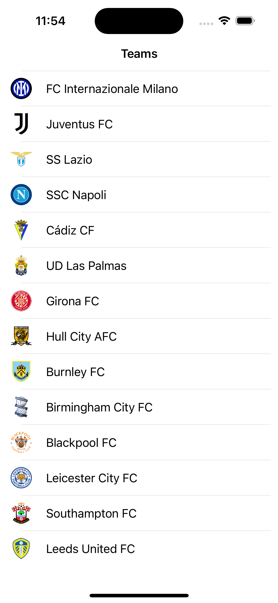
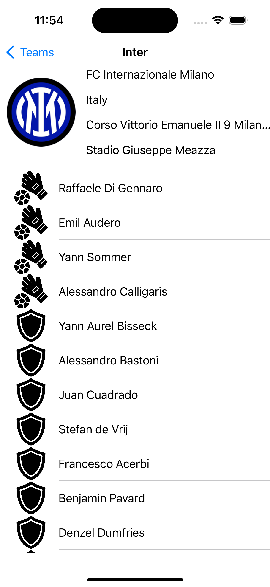
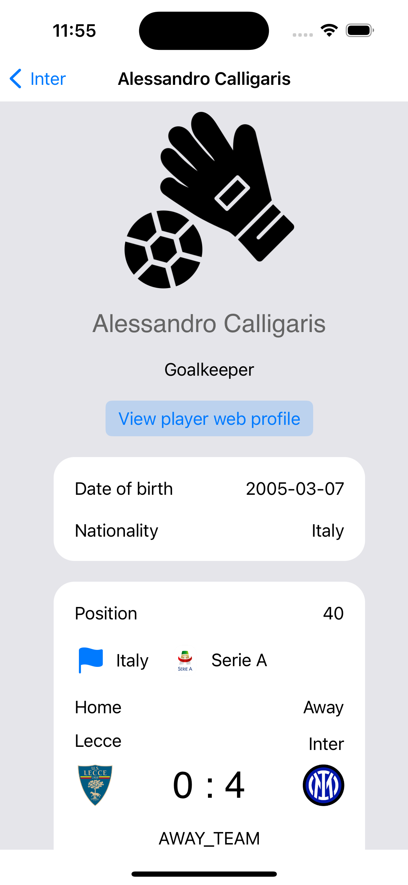
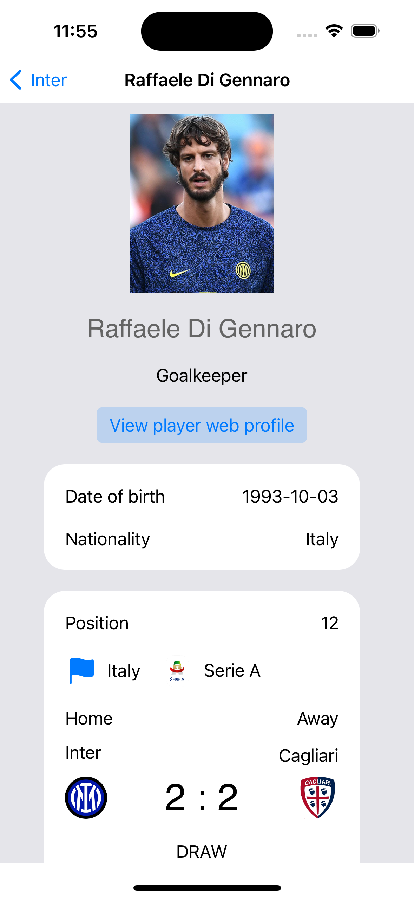
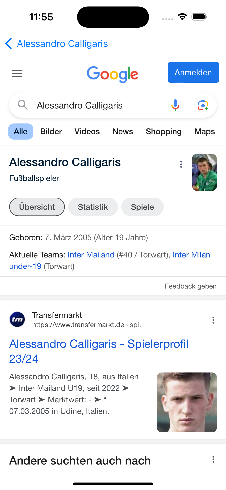

#### Teammate iOS project

Based on API https://www.football-data.org/

Created and tested on iPhone 15

List of teams is fetched from xml file that is included in project

Team logo is fetched from internet

Team info and list of players and all other information is from public football api

Web view is a link to google with name of player

Core Data update

Button to view personal teams

MyTeams table with actions

Add new team popup

Add player to my teams

Add player, teams view

Players notification of add or moving to another team

Project created by Conoval Andrei

For PDA

Profesor Marius Sabin TABIRCA
